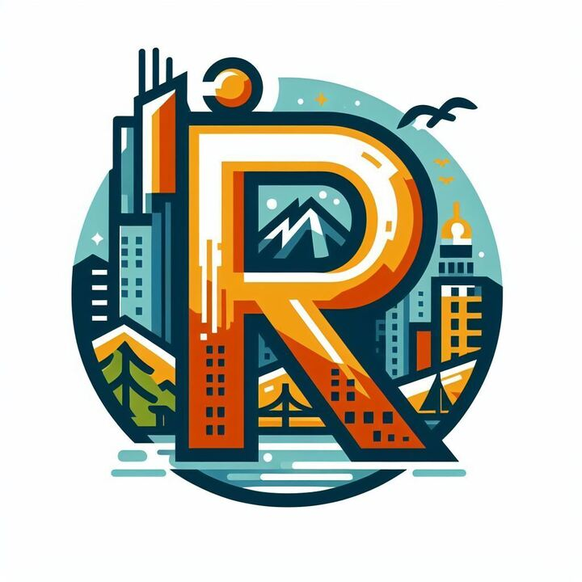
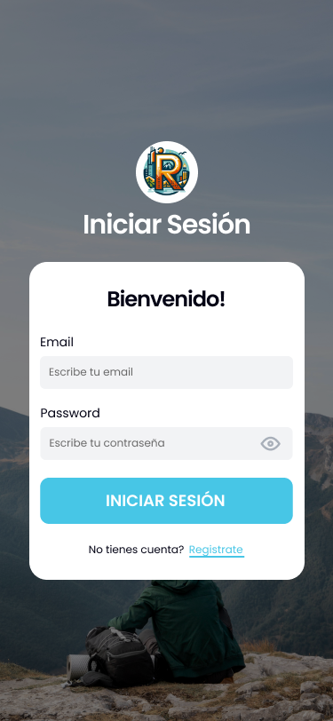
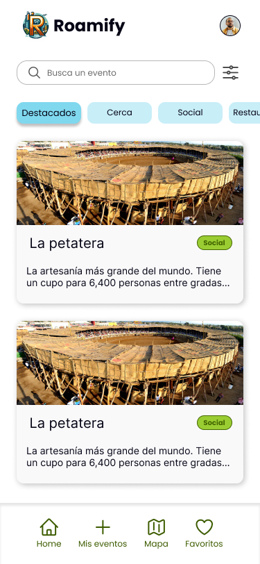
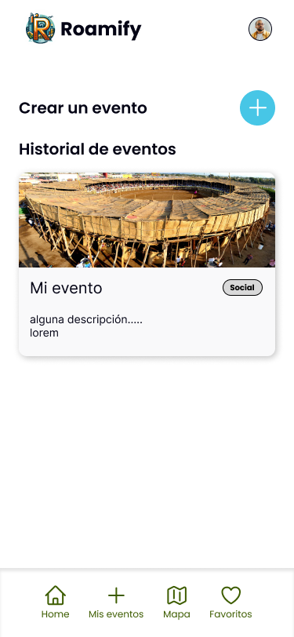
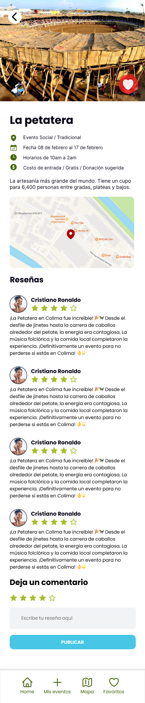
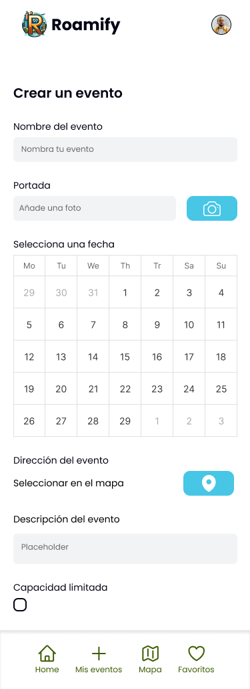
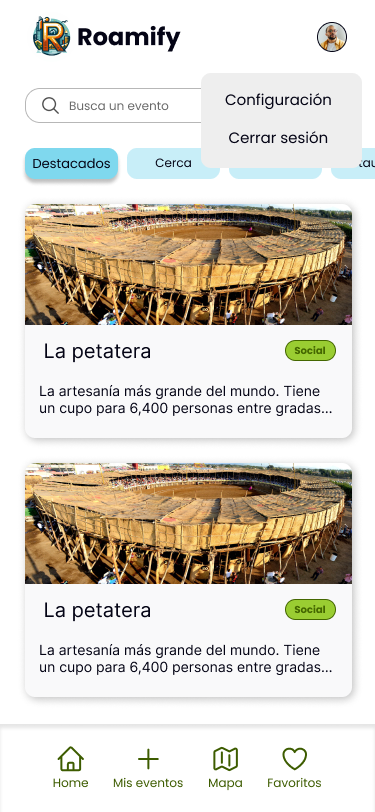
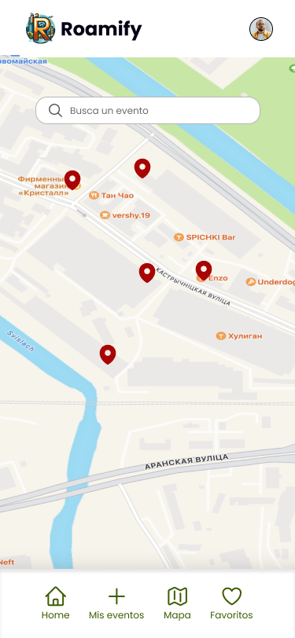
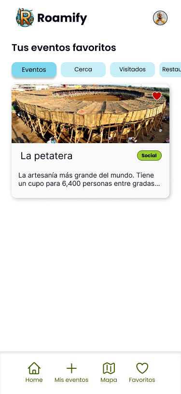

# Roamify

> [Instrucciones](./instructions/instructions.md)

- [Description](#description)
- [How To Instal](#how-to-install-and-run-the-project)
- [Functionalities](#functional-and-non-functional-requirements)
- [Design](#design)
- [Credits](#credits)
- [Badges](#badges)

## Description.

Roamify is your go-to mobile app for discovering all the cool stuff around you! From the hottest restaurants and tourist spots to hidden gems and beach hangouts, we've got it all covered. Plus, we'll keep you in the loop about social events, parties, and more happening nearby. With Roamify, exploring your neighborhood has never been more fun and easy. Get it now and start discovering the awesome stuff happening right in your backyard!

## How to Install and Run the Project.

**Run npm install** to install the necessary dependencies to run the project

Then start metro with **npm start**

Lastly start your android emulator using **npm run android**

## Functional and Non-Functional Requirements

### Functional Requirements:
1. **Authentication:**
   - Users must be able to log in using their email and password. 

2. **Component Loading (Login):**
   - Components must be available for login functionality and viewing users reviews.

3. **Search for Points of Interest:**
   - A search bar is required to allow users to search for points of interest by name or category.

4. **User Settings:**
   - Users should have the ability to adjust their preferences and account settings.

5. **Display Nearby Points of Interest:**
   - Users must be able to view nearby points of interest on a map based on their current location.

6. **Navigation Menu:**
   - There should be a navigation menu that includes options for account settings, places, and events (created, favorites, visited, upcoming, and today's events).

7. **Marking Favorite Places:**
   - Users should be able to mark places as favorites for easy access later.

8. **Event Creation:**
   - Users must be allowed to create events, providing details such as name, cover photo, date, location, description, and limited capacity.

9. **Reviews and Ratings for Events/Points of Interest:**
   - Users should be able to leave reviews and ratings for events and points of interest.

10. **Map Marker Filtering:**
    - Users must have the ability to filter map markers by categories such as events, tourist spots, and restaurants.

11. **App Location:**
    - The application must be configured to operate in a specific location, allowing users to view and create events in that location.

12. **Category Bar:**
    - There should be a category bar that facilitates the search and navigation of events and points of interest.

13. **Featured Events:**
    - Relevant events should be highlighted on the homepage, including social events, restaurants, and tourist spots on a map.

### Non-Functional Requirements:
1. **Navigability:**
   - An intuitive and seamless user experience must be ensured through clear and consistent navigation design.

2. **Security:**
   - Robust security measures must be implemented to protect users' confidential information and prevent unauthorized access.

3. **Data Integrity:**
   - Data integrity must be maintained through validation mechanisms and secure storage.

4. **Firebase:**
   - Firebase should be used as a platform for real-time function development and database management.

5. **Design in Figma:**
   - User interface designs should be created using the collaborative design tool Figma.

6. **Material Design:**
   - Material Design principles should be applied to ensure an aesthetically pleasing and consistent user interface.

7. **React Hook Forms:**
   - React Hook Forms should be employed for efficient and effective validation of forms within the application.

## Design

## Credits

- [Vanessa-Covarrubias-Nava](https://github.com/vanessa-covarrubias-nava)
- [ernesto2001-code](https://github.com/ernesto2001-code)
- [eCuevasCeballos](https://github.com/eCuevasCeballos)
- [vrojas2](https://github.com/vrojas2)

## Badges

[React Native](https://img.shields.io/badge/React_Native-v0.66.3-blue.svg)
[Android](https://img.shields.io/badge/Platform-Android-green.svg)

